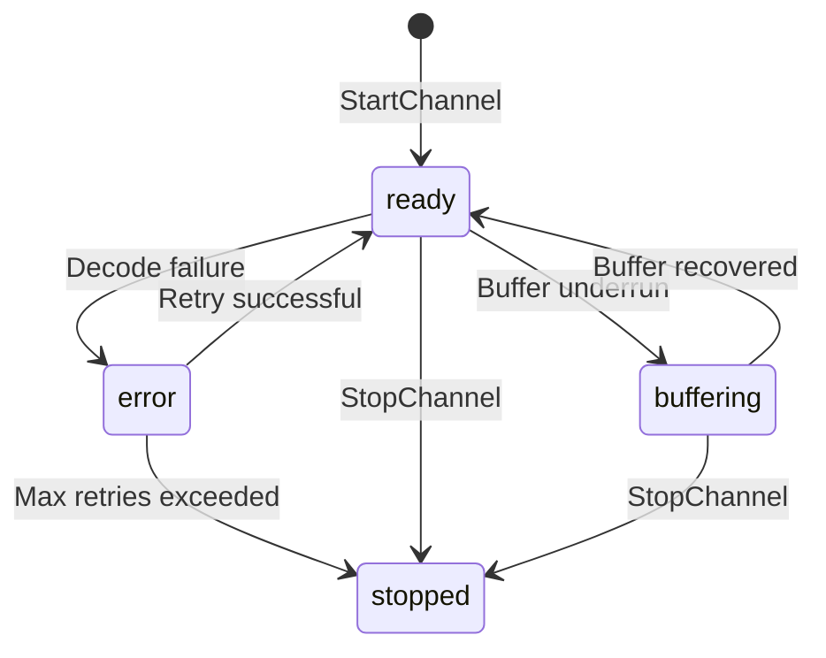
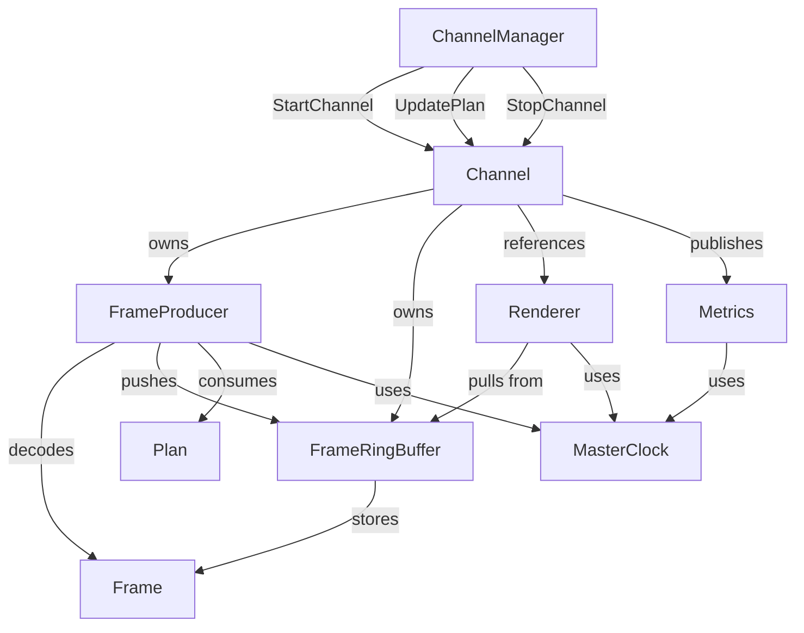

_Related: [Architecture Overview](../architecture/ArchitectureOverview.md) • [Playout Engine Contract](../contracts/PlayoutEngineContract.md) • [Runtime Model](../runtime/PlayoutRuntime.md) • [Phase 2 Goals](../milestones/Phase2_Plan.md)_

# Domain — Playout Engine

Status: Enforced

## Purpose

This document defines the **domain-level contract** for the RetroVue Playout Engine — the native C++ subsystem responsible for decoding media assets and delivering frame streams to the Renderer. It establishes core entities, relationships, invariants, lifecycle guarantees, threading models, and telemetry expectations that govern the playout engine's behavior within the RetroVue runtime.

The playout engine translates ChannelManager playout plans into continuous, clock-aligned frame streams. It ensures deterministic decode, maintains thread-safe buffering, and exposes comprehensive telemetry for operator visibility and runtime health monitoring.

---

## Core Entities

The playout engine domain consists of six primary entities:

### 1. Channel

**Purpose**: Represents a single broadcast channel worker that manages decode, buffering, and frame delivery for one logical channel.

**Ownership**: Each Channel instance owns:

- One `FrameProducer` (decode pipeline)
- One `FrameRingBuffer` (staging queue)
- One `FrameRenderer` reference (output consumer)
- One telemetry state object

**Identity**: Uniquely identified by a numeric `channel_id` (int32) issued by the ChannelManager.

**State Machine**:

| State       | Description                                              |
| ----------- | -------------------------------------------------------- |
| `ready`     | Channel is actively decoding and delivering frames       |
| `buffering` | Channel is rebuilding buffer depth after underrun        |
| `error`     | Fatal error occurred; channel awaiting retry or shutdown |
| `stopped`   | Channel has been gracefully shut down                    |

**State Transitions**:



**Invariants**:

- A Channel must have exactly one associated `FrameProducer` and `FrameRingBuffer` when state is `ready` or `buffering`
- Channel state transitions are atomic and immediately reflected in telemetry
- Channels cannot transition from `stopped` to any other state (terminal state)

---

### 2. Frame

**Purpose**: Represents a single decoded video frame with associated timing and provenance metadata.

**Structure**:

```cpp
struct Frame {
    uint8_t* data;           // YUV420 planar frame data
    size_t size;             // Total buffer size in bytes
    FrameMetadata metadata;  // Timing and provenance
};

struct FrameMetadata {
    int64_t pts;             // Presentation timestamp (microseconds)
    int64_t dts;             // Decode timestamp (microseconds)
    double duration;         // Frame duration (seconds)
    std::string asset_uri;   // Source asset identifier
    int width;               // Frame width in pixels
    int height;              // Frame height in pixels
};
```

**Lifecycle**:

1. **Decode**: Frame is allocated and decoded by `FrameProducer`
2. **Stage**: Frame is pushed to `FrameRingBuffer` with metadata
3. **Consume**: Frame is popped by `FrameRenderer` for output
4. **Release**: Frame memory is freed after rendering

**Invariants**:

- PTS must be monotonically increasing within a single asset stream
- DTS ≤ PTS for all frames
- Duration must be positive and non-zero
- Frame data must be in YUV420 planar format (Y, U, V planes)
- Width and height must match channel configuration

---

### 3. Plan

**Purpose**: An opaque reference to a playout plan generated by ChannelManager that describes what assets to decode and when.

**Representation**: String handle (e.g., `"morning_block"`, `"plan_uuid_123"`) resolved by ChannelManager via shared storage or IPC.

**Usage**:

- Passed in `StartChannel` to initialize decode pipeline
- Passed in `UpdatePlan` to hot-swap active content
- Engine does not parse plan contents; treats as opaque reference

**Lifecycle**:

1. **Creation**: ChannelManager generates plan based on schedule
2. **Registration**: Plan is registered in shared storage accessible to playout engine
3. **Activation**: Plan handle is passed to playout engine via gRPC
4. **Resolution**: Engine resolves plan to asset list and timing instructions
5. **Expiration**: Plan becomes inactive after `UpdatePlan` or `StopChannel`

**Invariants**:

- Plan handles are immutable once issued
- Plans must be resolvable to a sequence of asset URIs with start/duration metadata
- Invalid plan handles result in channel `error` state

---

### 4. Renderer

**Purpose**: Consumer interface that pulls decoded frames from the playout engine and packages them for output (MPEG-TS, preview window, etc.).

**Interface Contract**:

```cpp
class FrameRenderer {
public:
    virtual ~FrameRenderer() = default;

    // Pull next frame from channel buffer
    virtual bool pull_frame(int channel_id, Frame& out_frame) = 0;

    // Check if renderer is ready to accept frames
    virtual bool is_ready() const = 0;

    // Get current buffer consumption rate (frames/second)
    virtual double get_fps() const = 0;
};
```

**Implementations**:

- `MPEGTSRenderer`: Packages frames into MPEG-TS streams
- `PreviewRenderer`: Displays frames in debug window (OpenGL/SDL)
- `HeadlessRenderer`: Consumes frames without output (testing)

**Expectations**:

- Renderer must maintain minimum consumption rate to prevent buffer overflow
- Renderer pulls frames at MasterClock-aligned intervals
- Renderer must handle frame timing metadata (PTS/DTS) correctly

**Invariants**:

- Renderer must not block decode threads
- Frame consumption rate must exceed decode rate by ≥ 5% to prevent buffer buildup
- Renderer must gracefully handle buffer underruns (return false on `pull_frame`)

---

### 5. Metrics

**Purpose**: Telemetry data exposed via Prometheus `/metrics` endpoint for monitoring channel health, performance, and timing accuracy.

**Core Metrics**:

| Metric Name                               | Type      | Labels    | Unit    | Description                                                     |
| ----------------------------------------- | --------- | --------- | ------- | --------------------------------------------------------------- |
| `retrovue_playout_channel_state`          | Gauge     | `channel` | enum    | Current channel state: 0=stopped, 1=buffering, 2=ready, 3=error |
| `retrovue_playout_buffer_depth_frames`    | Gauge     | `channel` | frames  | Number of frames currently staged in ring buffer                |
| `retrovue_playout_frame_gap_seconds`      | Gauge     | `channel` | seconds | Deviation from MasterClock scheduled PTS                        |
| `retrovue_playout_decode_failure_count`   | Counter   | `channel` | count   | Total decode errors since channel start                         |
| `retrovue_playout_frames_decoded_total`   | Counter   | `channel` | frames  | Total frames successfully decoded                               |
| `retrovue_playout_frames_dropped_total`   | Counter   | `channel` | frames  | Frames dropped due to buffer overflow                           |
| `retrovue_playout_buffer_underrun_total`  | Counter   | `channel` | count   | Number of buffer underrun events                                |
| `retrovue_playout_decode_latency_seconds` | Histogram | `channel` | seconds | Time from packet read to frame ready                            |
| `retrovue_playout_channel_uptime_seconds` | Gauge     | `channel` | seconds | Time since channel entered `ready` state                        |

**Update Frequency**:

- State metrics: Updated immediately on state change
- Buffer metrics: Updated on every push/pop operation
- Counters: Incremented atomically
- Histograms: Sampled per-frame

**Invariants**:

- Metrics must be thread-safe (atomic updates)
- Metrics endpoint must respond within 100ms
- All metrics must include `channel` label for multi-channel deployments

---

### 6. MasterClock

**Purpose**: Single source of truth for time synchronization across the RetroVue runtime. The playout engine uses MasterClock to align frame PTS with scheduled broadcast time.

**Interface** (consumed from RetroVue runtime):

```cpp
class MasterClock {
public:
    // Get current UTC time (microseconds since epoch)
    virtual int64_t now_utc_us() const = 0;

    // Get current local time (microseconds since epoch)
    virtual int64_t now_local_us() const = 0;

    // Convert UTC to local time
    virtual int64_t to_local(int64_t utc_us) const = 0;

    // Calculate offset from scheduled time
    virtual int64_t offset_from_schedule(int64_t scheduled_pts) const = 0;
};
```

**Usage**:

- Frame PTS is compared against `now_utc_us()` to compute `frame_gap_seconds`
- Renderer uses MasterClock to determine when to pull next frame
- Telemetry uses MasterClock for `channel_uptime_seconds`

**Guarantees**:

- Time never goes backward (monotonic)
- All returned timestamps are timezone-aware
- Precision: microsecond resolution

**Invariants**:

- Playout engine must never call system time functions directly (`time()`, `gettimeofday()`, etc.)
- All timing calculations must use MasterClock
- Clock skew between runtime and engine must be ≤ 50ms

---

## Entity Relationships

The following diagram illustrates ownership and communication paths:



**Key Relationships**:

1. **Channel → FrameProducer** (1:1 ownership)

   - Channel creates and owns producer lifecycle
   - Producer runs in dedicated decode thread
   - Channel stops producer on shutdown

2. **Channel → FrameRingBuffer** (1:1 ownership)

   - Channel allocates buffer on startup
   - Buffer size is configurable per channel
   - Channel destroys buffer on shutdown

3. **Channel → FrameRenderer** (N:1 reference)

   - Multiple channels may share one Renderer
   - Renderer is owned by playout service
   - Channel holds weak reference

4. **FrameProducer → Plan** (N:1 consumption)

   - Producer resolves plan to asset list
   - Multiple producers may use same plan (different channels)
   - Plan is immutable during decode

5. **FrameRingBuffer → Frame** (1:N storage)
   - Buffer stores multiple frames simultaneously
   - Frame ownership transfers: producer → buffer → renderer
   - Frames are freed after renderer consumes

---

## Lifecycle Guarantees

### Channel Lifecycle

**Startup** (`StartChannel`):

1. Validate channel_id and plan_handle
2. Allocate FrameRingBuffer (default: 60 frames)
3. Initialize FrameProducer with plan
4. Spawn decode thread
5. Transition to `buffering` state
6. Once buffer reaches minimum depth (30 frames), transition to `ready`
7. Emit `retrovue_playout_channel_state{channel="N"} = 2` (ready)

**Execution** (steady state):

1. Producer continuously decodes and pushes frames
2. Renderer continuously pulls and renders frames
3. Buffer maintains depth between 30-60 frames
4. Metrics updated on every operation
5. State remains `ready` unless error or underrun

**Plan Update** (`UpdatePlan`):

1. Set channel state to `buffering`
2. Drain remaining frames from current plan
3. Swap plan reference in producer
4. Resume decode from next scheduled segment
5. Rebuild buffer to minimum depth
6. Transition back to `ready`
7. Expected downtime: ≤ 500ms

**Shutdown** (`StopChannel`):

1. Set state to `stopped`
2. Signal decode thread to stop
3. Drain remaining frames from buffer
4. Join decode thread (timeout: 5s)
5. Release FrameProducer and FrameRingBuffer
6. Emit final metrics snapshot
7. Emit `retrovue_playout_channel_state{channel="N"} = 0` (stopped)

---

### Threading Model

The playout engine uses a **multi-threaded, lock-free** architecture:

**Thread Roles**:

| Thread              | Purpose                           | Count per Channel |
| ------------------- | --------------------------------- | ----------------- |
| Main / gRPC         | Handles control plane requests    | 1 (shared)        |
| Decode Worker       | Decodes frames from media assets  | 1                 |
| Metrics Exporter    | Serves `/metrics` endpoint        | 1 (shared)        |
| Renderer (external) | Pulls frames and generates output | 1 (shared)        |

**Synchronization**:

- **FrameRingBuffer**: Lock-free circular buffer with atomic head/tail indices
- **State transitions**: Atomic compare-and-swap on state variable
- **Metrics updates**: Atomic increment/store operations
- **No mutexes** in hot path (decode/push/pop operations)

**Thread Safety Guarantees**:

1. **Producer thread** (decode):

   - Exclusively pushes to FrameRingBuffer
   - Never blocks on buffer full (drops frame and increments counter)
   - Atomically updates decode metrics

2. **Consumer thread** (renderer):

   - Exclusively pops from FrameRingBuffer
   - Never blocks on buffer empty (returns false)
   - Atomically updates consumption metrics

3. **Control thread** (gRPC):
   - Can modify channel state atomically
   - Signals decode thread for shutdown
   - Safe to call during active decode

**Deadlock Prevention**:

- No nested locks
- Lock-free buffer eliminates producer-consumer deadlock
- State transitions use atomic operations
- Decode thread is interruptible

---

## Behavior Contracts

### BC-001: Frame Timing Accuracy

**Rule**: Frames delivered to renderer must maintain PTS accuracy within ±16.67ms (one frame @ 60fps) of scheduled time.

**Measurement**: `retrovue_playout_frame_gap_seconds`

**Enforcement**: If gap exceeds threshold:

1. Log warning
2. Increment `retrovue_playout_decode_failure_count`
3. If gap exceeds 5 seconds, transition to `error` state

---

### BC-002: Buffer Depth Guarantees

**Rule**: FrameRingBuffer must maintain depth between 30-60 frames during steady state.

**Minimum depth**: 30 frames (1 second @ 30fps)
**Maximum depth**: 60 frames (2 seconds @ 30fps)

**Enforcement**:

- Underrun (depth < 30): Transition to `buffering`, inject slate
- Overflow (depth > 60): Drop incoming frames, increment `retrovue_playout_frames_dropped_total`

---

### BC-003: Idempotent Control Operations

**Rule**: All gRPC control methods (`StartChannel`, `UpdatePlan`, `StopChannel`) must be idempotent.

**Examples**:

- `StartChannel` on already-started channel returns success (no-op)
- `StopChannel` on already-stopped channel returns success (no-op)
- `UpdatePlan` with same plan_handle is no-op

**Rationale**: Allows ChannelManager to retry failed operations without side effects.

---

### BC-004: Graceful Degradation

**Rule**: Decode failures must not crash the playout engine or other channels.

**Failure Handling**:

1. Catch all decode exceptions within channel worker
2. Transition channel to `error` state
3. Log error with asset_uri and error code
4. Attempt retry up to 5 times with exponential backoff (base: 1s)
5. If retries exhausted, fall back to slate loop
6. Emit `retrovue_playout_channel_state{channel="N"} = 3` (error)

**Cross-channel isolation**: One channel's failure must not affect other channels.

---

### BC-005: Resource Cleanup

**Rule**: All resources (memory, file handles, decoder contexts) must be released on channel shutdown.

**Resources**:

- FFmpeg contexts (`AVFormatContext`, `AVCodecContext`)
- Frame buffers (YUV420 data)
- Thread handles

**Verification**: No memory leaks detected after 1000 start/stop cycles (valgrind clean).

---

### BC-006: Monotonic PTS

**Rule**: Frame PTS must be strictly monotonically increasing within a single asset stream.

**Enforcement**:

- Producer validates PTS on every frame
- If PTS decreases or duplicates, log error and skip frame
- Increment `retrovue_playout_decode_failure_count`

**Exception**: PTS may reset when transitioning between assets (plan update).

---

## Telemetry Schema

### Prometheus Endpoint

**URL**: `http://localhost:9308/metrics`

**Format**: Prometheus text exposition format

**Example Output**:

```prometheus
# HELP retrovue_playout_channel_state Current state of playout channel
# TYPE retrovue_playout_channel_state gauge
retrovue_playout_channel_state{channel="1"} 2

# HELP retrovue_playout_buffer_depth_frames Number of frames in staging buffer
# TYPE retrovue_playout_buffer_depth_frames gauge
retrovue_playout_buffer_depth_frames{channel="1"} 45

# HELP retrovue_playout_frame_gap_seconds Deviation from scheduled PTS
# TYPE retrovue_playout_frame_gap_seconds gauge
retrovue_playout_frame_gap_seconds{channel="1"} 0.003

# HELP retrovue_playout_decode_failure_count Total decode failures
# TYPE retrovue_playout_decode_failure_count counter
retrovue_playout_decode_failure_count{channel="1"} 0

# HELP retrovue_playout_frames_decoded_total Total frames decoded
# TYPE retrovue_playout_frames_decoded_total counter
retrovue_playout_frames_decoded_total{channel="1"} 15420

# HELP retrovue_playout_frames_dropped_total Total frames dropped
# TYPE retrovue_playout_frames_dropped_total counter
retrovue_playout_frames_dropped_total{channel="1"} 0

# HELP retrovue_playout_buffer_underrun_total Buffer underrun events
# TYPE retrovue_playout_buffer_underrun_total counter
retrovue_playout_buffer_underrun_total{channel="1"} 0

# HELP retrovue_playout_decode_latency_seconds Decode latency distribution
# TYPE retrovue_playout_decode_latency_seconds histogram
retrovue_playout_decode_latency_seconds_bucket{channel="1",le="0.01"} 15200
retrovue_playout_decode_latency_seconds_bucket{channel="1",le="0.025"} 15400
retrovue_playout_decode_latency_seconds_bucket{channel="1",le="0.05"} 15420
retrovue_playout_decode_latency_seconds_bucket{channel="1",le="+Inf"} 15420
retrovue_playout_decode_latency_seconds_sum{channel="1"} 82.15
retrovue_playout_decode_latency_seconds_count{channel="1"} 15420

# HELP retrovue_playout_channel_uptime_seconds Time since channel ready
# TYPE retrovue_playout_channel_uptime_seconds gauge
retrovue_playout_channel_uptime_seconds{channel="1"} 514.23
```

---

### Metric Semantics

**State Encoding**:

- `0` = stopped
- `1` = buffering
- `2` = ready
- `3` = error

**Frame Gap** (`frame_gap_seconds`):

- Positive value: Frame is ahead of schedule (buffer buildup)
- Negative value: Frame is behind schedule (decode lag)
- Target: ≤ ±0.016 seconds (16ms)

**Buffer Depth** (`buffer_depth_frames`):

- Healthy range: 30-60 frames
- Warning: < 30 frames (underrun risk)
- Critical: < 10 frames (imminent underrun)

**Decode Latency** (`decode_latency_seconds`):

- Measures time from `av_read_frame()` to `push()` completion
- Target p95: ≤ 25ms
- Target p99: ≤ 50ms

---

## Versioning and Compatibility

### API Versioning

**Version Constant**: `PLAYOUT_API_VERSION` (defined in `proto/retrovue/playout.proto`)

**Current Version**: `1.0`

**Compatibility Rules**:

1. **Backward-compatible changes** (patch/minor):

   - Add new optional fields to messages
   - Add new metrics
   - Performance improvements
   - Bug fixes

2. **Backward-incompatible changes** (major):
   - Remove or rename message fields
   - Change field semantics
   - Remove metrics
   - Change state machine behavior

**Version Check**:

- ChannelManager sends `PLAYOUT_API_VERSION` in gRPC metadata
- Playout engine validates version on every request
- Mismatch results in `FAILED_PRECONDITION` gRPC status

---

### Proto Schema Contract

**Authoritative Source**: `proto/retrovue/playout.proto`

**Generation**:

- C++ stubs: `protoc --cpp_out=src/proto/`
- Python stubs: `protoc --python_out=src/retrovue/proto/`

**Synchronized Releases**:

- Schema changes require coordinated releases of:
  - `retrovue-core` (Python runtime)
  - `retrovue-playout` (C++ engine)

**Validation**:

- CI enforces proto compatibility checks
- Breaking changes block merge without version bump

---

## Error Handling and Recovery

### Error Categories

| Category        | Description                           | Recovery Strategy                  |
| --------------- | ------------------------------------- | ---------------------------------- |
| Decode Error    | FFmpeg decode failure (corrupt frame) | Skip frame, continue decode        |
| Asset Not Found | Plan references missing asset         | Transition to error, inject slate  |
| Buffer Overflow | Producer outpaces consumer            | Drop frames, log warning           |
| Buffer Underrun | Consumer outpaces producer            | Inject slate, transition buffering |
| Plan Invalid    | Cannot resolve plan_handle            | Return gRPC error, stay stopped    |
| Thread Crash    | Decode thread exits unexpectedly      | Attempt restart, max 5 retries     |

---

### Retry Policy

**Exponential Backoff**:

```
retry_delay = base_delay * (2 ^ attempt_count)
base_delay = 1.0 seconds
max_retries = 5
max_delay = 32 seconds
```

**Example Timeline**:

- Attempt 1: Wait 1s
- Attempt 2: Wait 2s
- Attempt 3: Wait 4s
- Attempt 4: Wait 8s
- Attempt 5: Wait 16s
- Give up, transition to `error` permanently

**Retry Triggers**:

- Decode thread crash
- Asset open failure
- Plan resolution failure

**No Retry**:

- Invalid plan_handle (immediate error response)
- `StopChannel` during retry (cancel retry, stop immediately)

---

### Slate Fallback

**Purpose**: Provide continuous output during asset failures or buffer underruns.

**Slate Source**: Static PNG image converted to YUV420 loop.

**Activation**:

1. Detect error condition (asset failure, underrun)
2. Transition to `buffering` state
3. Start slate injection loop (30fps, repeated frame)
4. Continue slate until:
   - Asset recovery succeeds, OR
   - Buffer rebuilds to minimum depth, OR
   - `StopChannel` is called

**Slate Frame**:

- Resolution: Matches channel configuration (e.g., 1920x1080)
- Format: YUV420 planar
- Content: "Technical Difficulties" or channel logo

---

## Performance Expectations

### Latency Targets

| Operation        | Target Latency | Measurement                           |
| ---------------- | -------------- | ------------------------------------- |
| StartChannel     | ≤ 2s           | gRPC request to first frame delivered |
| UpdatePlan       | ≤ 500ms        | gRPC request to resumed decode        |
| StopChannel      | ≤ 1s           | gRPC request to thread joined         |
| Frame Decode     | ≤ 25ms (p95)   | `decode_latency_seconds` histogram    |
| Buffer Push      | ≤ 1ms          | `push()` duration                     |
| Buffer Pop       | ≤ 1ms          | `pop()` duration                      |
| Metrics Endpoint | ≤ 100ms        | HTTP GET `/metrics` response time     |

---

### Throughput Targets

| Metric                   | Target               | Constraint                      |
| ------------------------ | -------------------- | ------------------------------- |
| Decode Throughput        | ≥ 60 fps per channel | Sustained, no frame drops       |
| Multi-channel Capacity   | ≥ 4 channels         | On 4-core CPU @ 3.0 GHz         |
| Memory per Channel       | ≤ 100 MB             | Steady state, buffer + decoder  |
| CPU per Channel (decode) | ≤ 25% of 1 core      | H.264 1080p30                   |
| Metrics Update Rate      | ≥ 10 Hz              | Buffer depth, frame gap updates |

---

### Scalability

**Horizontal Scaling**:

- Run multiple playout engine processes
- Each process handles 1-4 channels
- Channels assigned via load balancer or static config

**Vertical Scaling**:

- Decode threads scale with CPU cores
- Buffer size scales with available memory
- Metrics endpoint remains single-threaded

**Limits**:

- Max channels per process: 8 (reasonable)
- Max frame resolution: 4K (3840x2160)
- Max decode throughput: 240 fps aggregate (all channels)

---

## Testing and Validation

### Unit Tests

**Coverage Requirements**:

- FrameRingBuffer: 100% line coverage
- FrameProducer: ≥ 90% line coverage
- State transitions: All paths tested
- Error handling: All error codes tested

**Test Files**:

- `tests/test_buffer.cpp`: Ring buffer operations
- `tests/test_decode.cpp`: FFmpeg decode pipeline
- `tests/test_metrics.cpp`: Telemetry export
- `tests/test_lifecycle.cpp`: Channel start/stop/update

---

### Integration Tests

**Scenarios**:

1. **Happy path**: Start → Decode → Render → Stop
2. **Plan update**: Start → Decode → UpdatePlan → Resume → Stop
3. **Underrun recovery**: Start → Force underrun → Inject slate → Recover
4. **Error recovery**: Start → Force decode error → Retry → Recover
5. **Multi-channel**: Start 4 channels → Verify isolation → Stop all

**Validation**:

- Frame PTS monotonicity
- Buffer depth within bounds
- Metrics accuracy
- No memory leaks (valgrind)
- Thread safety (ThreadSanitizer)

---

### Contract Tests

**Purpose**: Verify gRPC contract compliance with ChannelManager expectations.

**Tests**:

- `test_start_channel_contract.py`: Validates `StartChannel` behavior
- `test_update_plan_contract.py`: Validates `UpdatePlan` behavior
- `test_stop_channel_contract.py`: Validates `StopChannel` behavior
- `test_idempotency_contract.py`: Validates idempotent operations
- `test_telemetry_contract.py`: Validates metrics format and accuracy

**Assertions**:

- Response fields match proto schema
- State transitions follow state machine
- Metrics are updated correctly
- Error messages are actionable

---

## Design Principles

1. **Deterministic behavior**: Same inputs produce same outputs; no hidden state.
2. **Thread safety**: Lock-free data structures; atomic operations for shared state.
3. **Graceful degradation**: Errors isolate to affected channel; no cascading failures.
4. **Observable**: Comprehensive metrics; all state changes logged and exposed.
5. **Testable**: Unit, integration, and contract tests cover all critical paths.
6. **Performance-first**: Hot paths avoid allocations, locks, and blocking I/O.
7. **Clock-aligned**: All timing driven by MasterClock; no system time dependencies.

---

## See Also

- [Architecture Overview](../architecture/ArchitectureOverview.md) — System context and component integration
- [Playout Engine Contract](../contracts/PlayoutEngineContract.md) — gRPC control plane contract
- [Metrics and Timing Domain](MetricsAndTimingDomain.md) — Time synchronization and telemetry
- [Renderer Domain](RendererDomain.md) — Frame consumption and output
- [Runtime Model](../runtime/PlayoutRuntime.md) — Execution model and threading details
- [Phase 2 Goals](../milestones/Phase2_Plan.md) — Implementation milestones and deliverables
- [Development Standards](../developer/DevelopmentStandards.md) — C++ project structure and conventions
- [RetroVue MasterClock](../../Retrovue/docs/domain/MasterClock.md) — Time synchronization contract
- [RetroVue ChannelManager](../../Retrovue/docs/runtime/ChannelManager.md) — Control plane orchestrator
